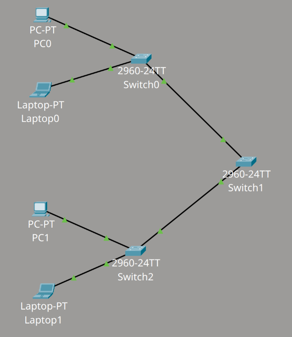
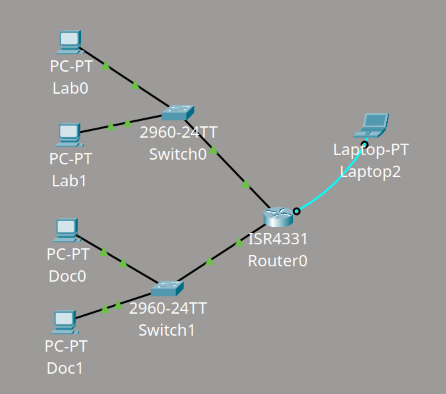
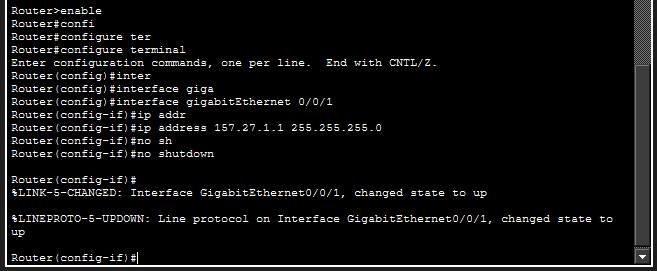

# Packet Tracer

### [[2026/Conf-apparati-rete/Packet Tracer Saves/4 pc 3 switch.pkt|4 PC 3 SWITCH]]

In questa rete non ci sono router quindi non c'è bisogno di inserire un gateway.
Tutti i dispositivi sono nella stessa rete `157.27.1.x` con subnet mask `255.255.0.0`. Tutti i dispositivi sono raggiungibili ed è verificato con il comando `ping`.
### [[2026/Conf-apparati-rete/Packet Tracer Saves/2 lan.pkt|2 LAN]]

Lo switch0 fa parte della rete: `157.27.0.x`
Lo switch1 fa parte della rete: `157.27.1.x`
I gateway (l'indirizzo del router) hanno `x` = `1`
La subnet mask è: `255.255.255.0`

Per configurare il router verso la rete dello switch1 i comandi sono:

### [[2026/Conf-apparati-rete/Packet Tracer Saves/2 vlan.pkt|2 VLAN]]
