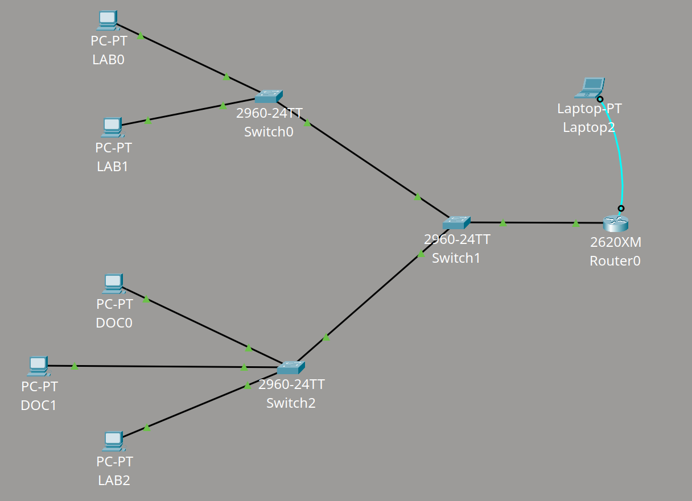
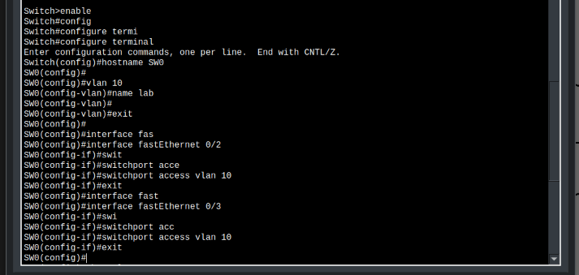
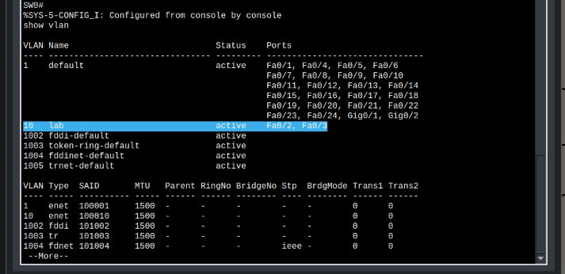
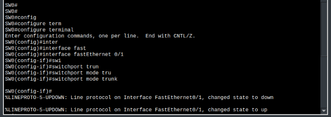
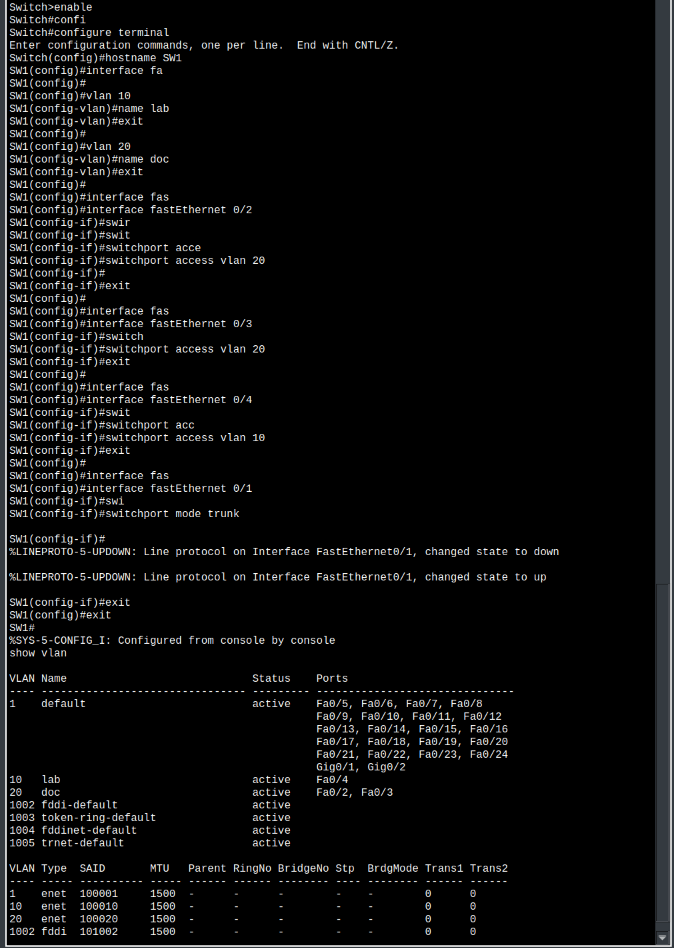
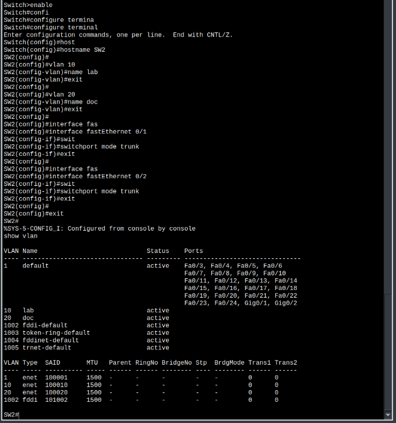
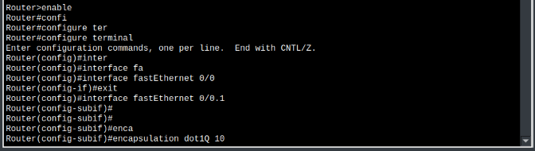
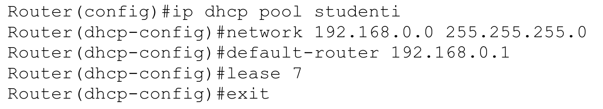

---
tags:
  - Soluzioni
---
# Packet Tracer

### [[2026/Conf-apparati-rete/Packet Tracer Saves/4 pc 3 switch.pkt|4 PC 3 SWITCH]]

In questa rete non ci sono router quindi non c'è bisogno di inserire un gateway.
Tutti i dispositivi sono nella stessa rete `157.27.1.x` con subnet mask `255.255.0.0`. Tutti i dispositivi sono raggiungibili ed è verificato con il comando `ping`.
### [[2026/Conf-apparati-rete/Packet Tracer Saves/2 lan.pkt|2 LAN]]

Lo switch0 fa parte della rete: `157.27.0.x`
Lo switch1 fa parte della rete: `157.27.1.x`
I gateway (l'indirizzo del router) hanno `x` = `1`
La subnet mask è: `255.255.255.0`

Per configurare il router verso la rete dello switch1 i comandi sono:

### [[2026/Conf-apparati-rete/Packet Tracer Saves/2 vlan.pkt|2 VLAN]]

Il router (`2620XM`) fa parte della famiglia 802.1q. Ha una sola interfaccia di rete che è divisibile in più [[Extra#VLAN|VLAN]]. La configurazione delle VLAN nello switch0 è scritta in questo modo:

Nello switch2 sono presenti entrambe le VLAN:

E anche nello switch1:

La configurazione del router (solo verso la VLAN 10 ovvero lab) invece è fatta in questo modo:

(da non dimenticare di aggiungere la VLAN 20 ovvero doc e il no shutdown sul'interfaccia 0/0)
### [[2026/Conf-apparati-rete/Packet Tracer Saves/2 vlan dhcp.pkt|2 VLAN DHCP]]
In questo caso abbiamo lo stesso esercizio come quello precedente con l'aggiunta del server [[Extra#DHCP|DHCP]]. La configurazione aggiuntiva da fare al router viene fatta in questo modo:

La riga `lease 7` è la durata che un dispositivo mantiene l'indirizzo IP per la durata (in questo caso) di 7 giorni. Più generalmente: `lease <giorni> <ore> <minuti>`.
Ricordare che il server DHCP è da attivare sui dispositivi
### [[2026/Conf-apparati-rete/Packet Tracer Saves/wan.pkt|WAN]]
