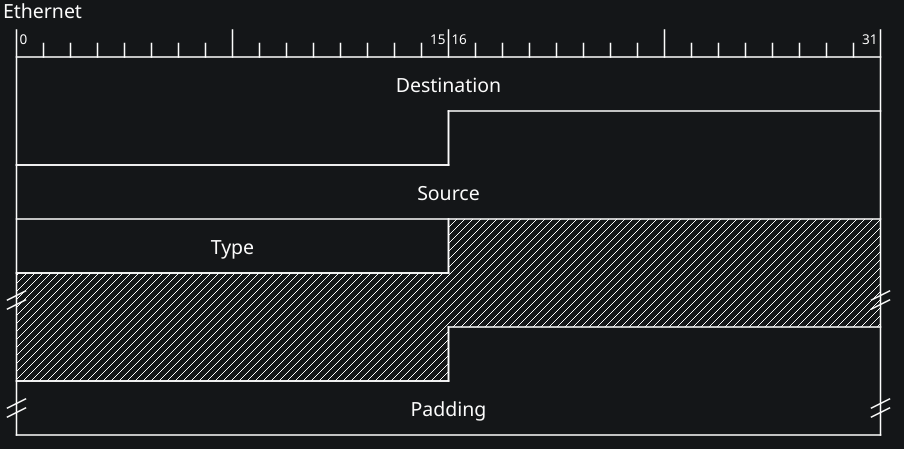
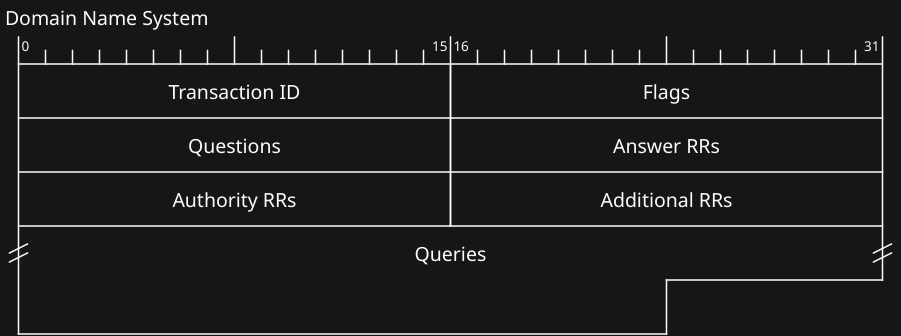
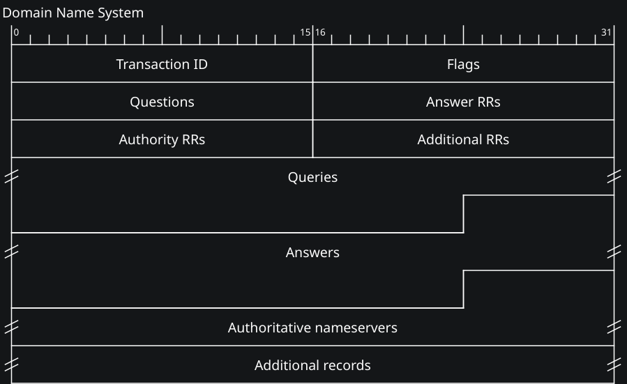
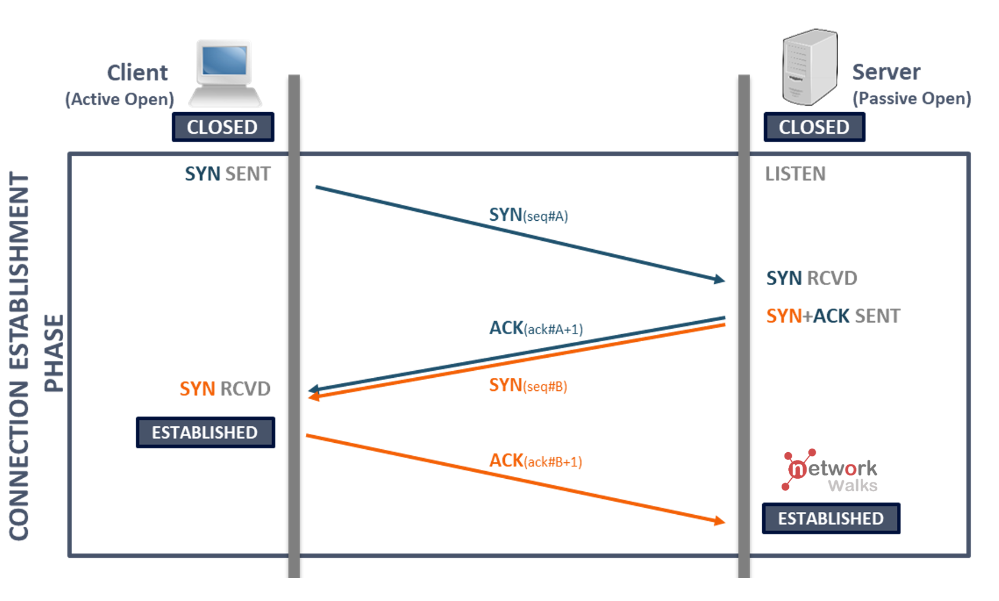

# Termini tecnici
**PDU** (Protocol Data Unit) di livello *<livello ISO/OSI>*
Il PDU è composto da Header e payload

# Metodi di trasmissione
La trasmissione avviene sempre da un solo mittente **UNICAST**         = 1 destinatario
**MULTICAST**    = gruppo di destinatari
**BROADCAST**   = tutti i destinatari della rete

# Well-known ports
**80** = HTTP
**53** = [[#DNS]] 
**443** = HTTPS
**67 / 68** = DHCP
# ARP
ARP è un protocollo di mappatura utilizzato a <u>livello DATA-LINK</u> (MAC) e <u>NETWORK</u> (IP) che serve per ottenere l'indirizzo MAC di un host partendo dal suo IP.

*Come funziona?*
Una macchina host manda un pacchetto in **broadcast** (MAC destinatario ff:ff:ff:ff:ff:ff) con i propri dati (indirizzo IP e MAC) e chiede chi ha un determinato IP.
Solo la macchina con quel determinato IP risponde inviando un pacchetto *ARP reply* in **unicast** (diretto solo al richiedente) condividendo il suo indirizzo MAC.

Destination = **MAC broadcast** (ff:ff:ff:ff:ff:ff)
Source = MAC sorgente
Type = <code>0x0806</code> identificativo protocollo ARP
Area a linee = il contenuto ARP
Padding = zeri extra per allungare il pacchetto

I pacchetti devono avere dimensione minima **64 byte**. Serve a garantire che il segnale elettrico resti sul cavo abbastanza a lungo da permettere a tutte le schede di rete di rilevare eventuali **collisioni**

**NB:** anche conoscendo l'IP, l'host manda il pacchetto di tipo broadcast anche a livello Network. L'IP viene usato solo come domanda nel payload.

# DNS
Il DNS (Domain Name System) è un protocollo che permette di trasformare un dominio (google.it) in un indirizzo IP (142.250.180.14). Lavora sul livello <u>APPLICAZIONE</u>.

*L'Header del DNS*
1. <b>Ethernet II</b> con i MAC address
2. <b>IPv4</b> con gli indirizzi IP
3. <b>UDP</b> protocollo UDP (porta <b>53</b>)
4. <b>DNS</b> domanda o risposta

*Header domanda*

*Header risposta*

*Transaction ID* = numero casuale identificativo, quando un client riceve una risposta sa a quale domanda si riferisce
*Flags*:
- Query/response -> se è una domanda 0, se è una risposta 1
- Recursion desired -> chiedi a qualcun'altro se non sai rispondere 1, dimmi a chi chiedere se non sai rispondere 0
*Authoritative nameservers* = quali server sono "proprietari" ufficiali del dominio
*Additional records* = informazioni utili (IP server autoritativi)

# DHCP

# TCP

### Three way handshake

# UDP

# ICMP