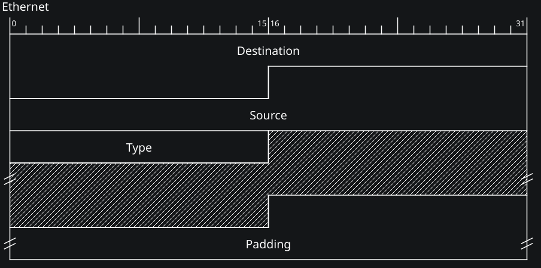
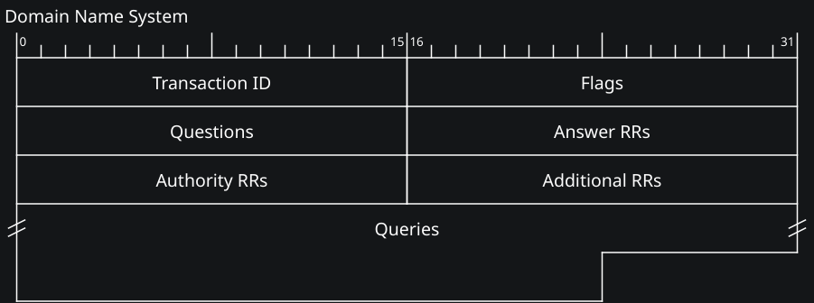
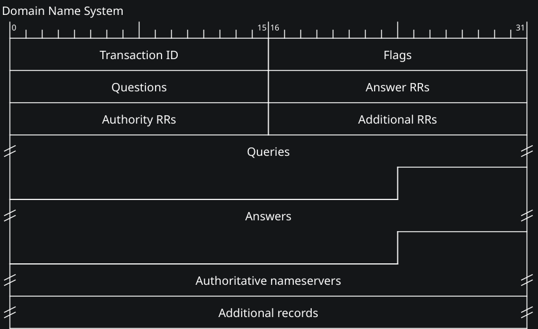
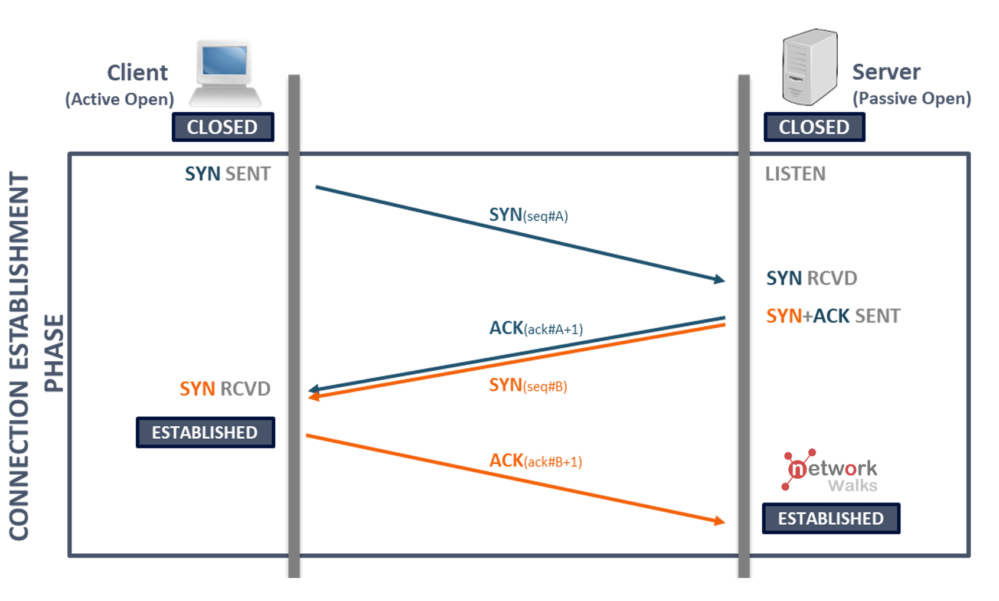

# Termini tecnici
**PDU** (Protocol Data Unit) di livello *<livello ISO/OSI>*
Il PDU è composto da Header e payload

# Metodi di trasmissione
La trasmissione avviene sempre da un solo mittente
 **UNICAST**         = 1 destinatario **MULTICAST**    = gruppo di destinatari **BROADCAST**   = tutti i destinatari della rete

# Web-Services
I WebServices sono sistemi software progettati per far comunicare due macchine o applicazioni senza *intervento umano*. In pratica permettono la condivisione di dati eliminando limitazioni di **macchina**, grazie alla possibilità di collegamento tramite il web, e di **linguaggio di programmazione**, ovvero non importa il linguaggio di programmazione utilizzato per creare il codice su cui si basano i processi.

# REST
(*REpresentional State Transfer*)
E' uno **stile architetturale**, ovvero un insieme di regole e linee guida su come progettare web-services semplici, veloci e scalabili.
**RESTful** è come viene chiamato un web-service che segue queste proprietà.

Parole chiave importanti:
- **Risorse ->** Basato sulle risorse
- **Stateless ->** Il server non deve ricordarsi nulla delle richieste precedenti
- **Rappresentazione standard ->** Rappresentazione della risorsa, tipicamente in json

# Well-known ports
**80** = HTTP **53** = [[#DNS]]  **443** = HTTPS **67 / 68** = [[#DHCP]]

# ARP
(*Address Resolution Protocol*)
 ARP è un protocollo di mappatura utilizzato a <u>livello DATA-LINK</u> (MAC) e <u>NETWORK</u> (IP) che serve per ottenere l'indirizzo MAC di un host partendo dal suo IP.

*Come funziona?*
Una macchina host manda un pacchetto in **broadcast** (MAC destinatario ff:ff:ff:ff:ff:ff) con i propri dati (indirizzo IP e MAC) e chiede chi ha un determinato IP.
Solo la macchina con quel determinato IP risponde inviando un pacchetto *ARP reply* in **unicast** (diretto solo al richiedente) condividendo il suo indirizzo MAC.

Destination = **MAC broadcast** (ff:ff:ff:ff:ff:ff)
Source = MAC sorgente
Type = <code>0x0806</code> identificativo protocollo ARP
Area a linee = il contenuto ARP
Padding = zeri extra per allungare il pacchetto

I pacchetti devono avere dimensione minima **64 byte**. Serve a garantire che il segnale elettrico resti sul cavo abbastanza a lungo da permettere a tutte le schede di rete di rilevare eventuali **collisioni**

**NB:** anche conoscendo l'IP, l'host manda il pacchetto di tipo broadcast anche a livello Network. L'IP viene usato solo come domanda nel payload.

# DNS
(*Domain Name System*)
Il DNS è un protocollo che permette di trasformare un dominio (google.it) in un indirizzo IP (142.250.180.14). Lavora sul livello <u>APPLICAZIONE</u>.

*L'Header del DNS*
1. <b>Ethernet II</b> con i MAC address
2. <b>IPv4</b> con gli indirizzi IP
3. <b>UDP</b> protocollo UDP (porta <b>53</b>)
4. <b>DNS</b> domanda o risposta

*Header domanda*

*Header risposta*

<b>Transaction ID</b> = numero casuale identificativo, quando un client riceve una risposta sa a quale domanda si riferisce
 <b>Flags</b>:
- Query/response -> se è una domanda 0, se è una risposta 1
 - Recursion desired -> chiedi a qualcun'altro se non sai rispondere 1, dimmi a chi chiedere se non sai rispondere 0
 <b>Authoritative nameservers</b> = quali server sono "proprietari" ufficiali del dominio
 <b>>Additional records</b> = informazioni utili (IP server autoritativi)

# DHCP
(*Dynamic Host Configuration Protocol*)
 E' un protocollo di rete che assegna automaticamente un indirizzo IP, subnet mask, gateway e [[#DNS]]. 
 Passaggi di funzionamento:
- Il dispositivo invia una richiesta broadcast per **trovare un server DHCP**;
- Il server DHCP riceve la richiesta e **propone un indirizzo IP** libero;
- Il dispositivo **accetta l'indirizzo IP**;
- Il server conferma l'avvenuta assegnazione (con lease time -> tempo di affitto).

**Automatico =** Collegamenti senza intervento manuale.
 **Prevenzione =** Evita potenziali errori di assegnazione accidentale.
 **Ottimizzazione =** Recupera e assegna automaticamente gli indirizzi IP.

**NB:** Il messaggio di broadcast inviato dal nuovo dispositivo usa come indirizzo sorgente `0.0.0.0` e come destinazione `255.255.255.255`. Per la verificazione del dispositivo viene inviato anche il MAC.

# LAN

# WAN

# VLAN
(*Virtual Local Area Network*)

# TCP
(*Transmission Control Protocol*)
Il TCP è un protocollo di livello trasporto. Garantisce una trasmissione di dati:
- **Affidabile =** nessun pacchetto viene perso (quelli persi vengono ritrasmessi);
- **Ordinata =** i pacchetti sono numerati sequenzialmente.
### Three way handshake

# UDP
(*User Datagram Protocol*)
L'UDP è un protocollo di livello trasporto. Progettato per la massima velocità, invia dati direttamente senza stabilire una connessione (diversamente dal TCP). Protocollo usato per servizi usare in tempo reale.

# ICMP
(*Internet Control Message Protocol*)
ICMP è un protocollo a livello rete (livello 3). Viene utilizzato per:
- **Segnalazione degli errori =** Se un pacchetto non raggiunge la destinazione o si verifica un problema e viene restituito l'errore;
- **Test di connettività =** Protocollo usato dal comando `ping`.

ICMP è un protocollo che non usa le porte.

# Loopback
I pacchetti loopback sono segnali o dati che vengono rispediti direttamente al mittente originale senza alcuna elaborazione intermedia.
Vengono principalmente usati per testare hardware, diagnosticare guasti, configurare indirizzi logici stabili e prevenire anomalie di rete.

Esempio, durante la costruzione di un sito internet può essere usato `loopback:<porta>` o `127.0.0.1:<porta>`. 

# PUB/SUB
**Non è un protocollo** ma un modo.
Le due entità principali:
- Publisher -> si comporta come client
- Subscriber -> si comporta come server (ma in realtà è un client)
- Broker -> entità di intermezzo che comunica con i due (vero server)
