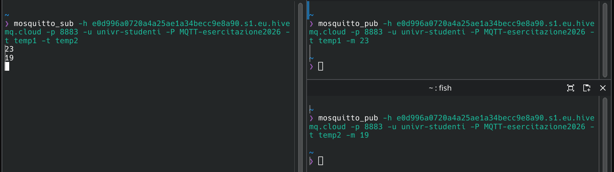

---
tags:
  - Soluzioni
---
Info [[Extra#PUB/SUB|PUB/SUB]]
### [[2026/MQTT/Pub-sub.pdf#page=22&selection=50,0,50,19&color=note|Esercizi su pub/sub]]
Comando per far partire il subscriber:

<code>❯ mosquitto_sub -h e0d996a0720a4a25ae1a34becc9e8a90.s1.eu.hivemq.cloud -p 8883 -u univr-studenti -P MQTT-esercitazione2026 -t temperatura</code>

Comando per far mandare il messaggio il publisher:

<code>❯ mosquitto_pub -h e0d996a0720a4a25ae1a34becc9e8a90.s1.eu.hivemq.cloud -p 8883 -u univr-studenti -P MQTT-esercitazione2026 -t temperatura -m 52</code>

**Leggenda:**  -h = host a cui connettersi -p = porta -u = username -P = password -t = nome del topic -m = messaggio -d = debug

1. Se pubblico una temperatura prima di aver lanciato il subscriber il messaggio viene inviato, unica cosa è che non posso visualizzare l'arrivo.
Con l'opzione `--retain` il messaggio viene salvato nel buffer, infatti quando poi lancio il subscriber arriva il messaggio.
**NB:** per togliere il messaggio dal buffer: `-r -n` dove `-n` è il messaggio nullo
2. Visto che ho 2 sensori è corretto aprire un terminale per sensore (publisher), sommando il terminale subscriber abbiamo bisogno in totale di 3 terminali:

3. Per avere entrambe le temperature su un terminale solo si aggiunge questo al comando:

... -t temp1 -t temp2 -v

dove `temp1` e `temp2` sono le due stanze e `-v` ci permette di vedere da dove quale publisher arrivano le informazioni.
