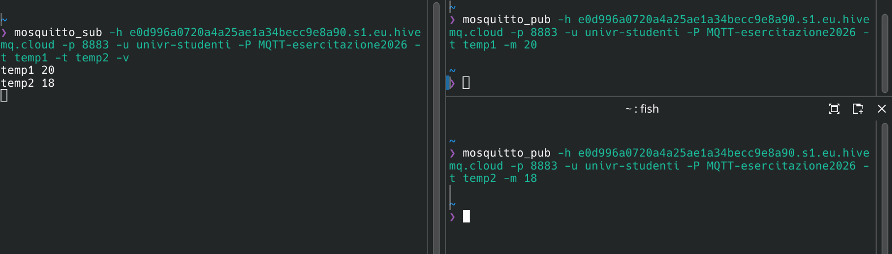
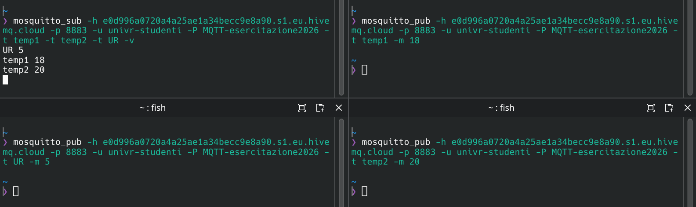

---
tags:
  - Soluzioni
---
Info [[Extra#PUB/SUB|PUB/SUB]]
### [[2026/MQTT/Pub-sub.pdf#page=22&selection=50,0,50,19&color=note|Esercizi su pub/sub]]
Comando per far partire il subscriber:

<code>❯ mosquitto_sub -h e0d996a0720a4a25ae1a34becc9e8a90.s1.eu.hivemq.cloud -p 8883 -u univr-studenti -P MQTT-esercitazione2026 -t temperatura</code>

Comando per far mandare il messaggio il publisher:

<code>❯ mosquitto_pub -h e0d996a0720a4a25ae1a34becc9e8a90.s1.eu.hivemq.cloud -p 8883 -u univr-studenti -P MQTT-esercitazione2026 -t temperatura -m 52</code>

**Leggenda:**  -h = host a cui connettersi -p = porta -u = username -P = password -t = nome del topic -m = messaggio -d = debug

1. Se pubblico una temperatura prima di aver lanciato il subscriber il messaggio viene inviato, unica cosa è che non posso visualizzare l'arrivo.
Con l'opzione `--retain` il messaggio viene salvato nel buffer, infatti quando poi lancio il subscriber arriva il messaggio.
**NB:** per togliere il messaggio dal buffer: `-r -n` dove `-n` è il messaggio nullo
2. Visto che ho 2 sensori è corretto aprire un terminale per sensore (publisher), sommando il terminale subscriber abbiamo bisogno in totale di 3 terminali:

3. Per avere entrambe le temperature su un terminale solo si aggiunge questo al comando:

... -t temp1 -t temp2 -v

dove `temp1` e `temp2` sono le due stanze e `-v` ci permette di vedere da dove quale publisher arrivano le informazioni.

4. Il subscriber interessato alle temperature non riceve i valori dal publisher umidità (UR). Però con una modifica è possibile utilizzare un unico subscriber per farlo:

In alto a sinistra il subscriber che legge dati dai topic `temp1`, `temp2` e `UR`. Gli altri terminali sono invece i publisher e interpretano i tre sensori in questione.
5. Il livello di trasporto utilizzato per i pacchetti MQTT è il TCP. Le porte utilizzate sono la 1883 usata dal broker in ascolto, per i publisher e il subscriber ce ne sono di più: 60070, 38732, 46348, 39360 e 43278.
NB: filtrando per `mqtt` diventa più facile trovare i pacchetti di interesse.
La porta 60070 è quella usata dal subscriber, si trovano i pacchetti con questa porta tutta la durata dell'analisi della rete. La connessione è **una soltanto**.
Le altre porte sono dei publisher, ogni publisher crea una connessione TCP e si chiude una volta inviato il messaggio.
### [[2026/MQTT/Pub-sub.pdf#page=23&selection=26,0,26,19&color=note|Esercizi su pub/sub]]
Subscriber per il relatore:

<code>❯ mosquitto_sub -h e0d996a0720a4a25ae1a34becc9e8a90.s1.eu.hivemq.cloud -p 8883 -u univr-studenti -P MQTT-esercitazione2026 -t univr/#</code>

Subscriber per la segreteria:

<code>❯ mosquitto_sub -h e0d996a0720a4a25ae1a34becc9e8a90.s1.eu.hivemq.cloud -p 8883 -u univr-studenti -P MQTT-esercitazione2026 -t univr/docenti/# -t univr/studenti/#</code>

Subscriber per i docenti:

<code>❯ mosquitto_sub -h e0d996a0720a4a25ae1a34becc9e8a90.s1.eu.hivemq.cloud -p 8883 -u univr-studenti -P MQTT-esercitazione2026 -t univr/docenti/# -t univr/studenti/#</code>

Subscriber per gli studenti:

<code>❯ mosquitto_sub -h e0d996a0720a4a25ae1a34becc9e8a90.s1.eu.hivemq.cloud -p 8883 -u univr-studenti -P MQTT-esercitazione2026 -t univr/studenti/#</code>

L'aggiunta di univr al topic permette la scalabilità del sistema in modo che se in futuro dovesse essere aggiunto un'altra entità (o più di una) il sistema continuerà a funzionare, ovvero il rettore continuerà a leggere i messaggi di tutti.
Usando il carattere `#` diamo la possibilità di creare dei "sotto-topic" e che ogni entità universitaria della categoria giusta potrà leggerlo senza problemi.