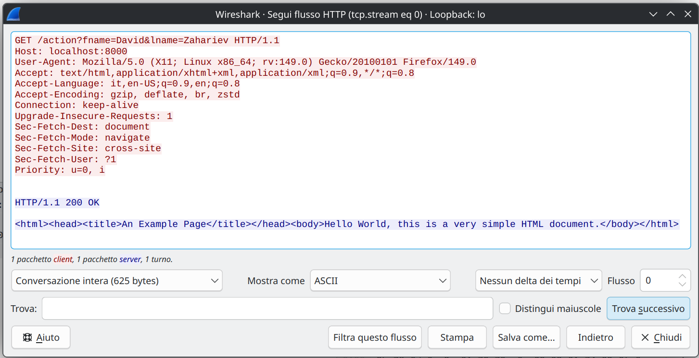
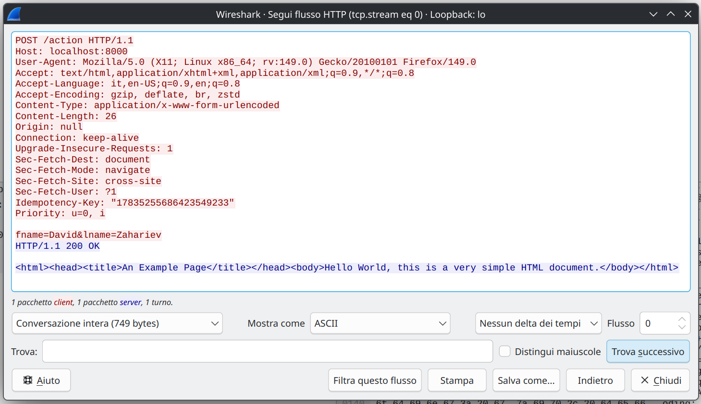
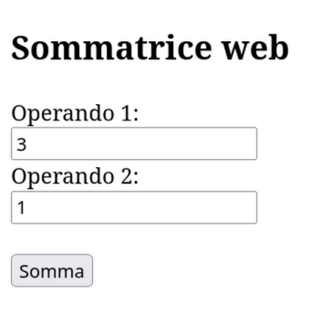

---
tags:
  - Soluzioni
---
### [[2026/Web/web-webservices.pdf#page=26&selection=2,0,2,9&color=note|Esercizio]]
[[2026/Web/web/javascript-load.html|Pagina]] HTML che ricarica periodicamente il sito dell'ANSA
```html
<!DOCTYPE html>
<html>
	<body>
		<iframe id="area" height="2000" width="1000"></iframe>
		<script>
			function displayHello() {
			document.getElementById("area").src = "https://www.ansa.it/sito/notizie/topnews/index.shtml";
			}
			displayHello;
			setInterval(displayHello, 5000);
		</script>
	</body>
</html>
```
### [[2026/Web/web-webservices.pdf#page=29&selection=2,0,2,22&color=note|Un semplice web server]]
Se provo ad avviare [[2026/Web/Esempi-web/serverHTTP.c|serverHTTP]] su due terminali diversi il secondo non si avvia perché il server è TCP e, come detto nei capitoli precedenti la porta è già occupata dal primo server.
Quando faccio `http://127.0.0.1:8000/` sul browser mi compare la pagina bianca con scritto `Hello World, this is a very simple HTML document.`.
Sul terminale invece esce questo:
```
Accept-Encoding: gzip, deflate, br, zstd
Connection: keep-alive
Referer: http://localhost:8000/
Sec-Fetch-Dest: image
Sec-Fetch-Mode: no-cors
Sec-Fetch-Site: same-origin
Priority: u=6

[SERVER] sessione HTTP completata
```
Se invece imposto l'URL `http://localhost:8000/` il risultato non cambia.
### [[2026/Web/web-webservices.pdf#page=31&selection=2,0,2,9&color=note|Esercizio]]
Quando apro [[2026/Web/web/form-get.html|form-get.html]] vedo la pagina html in locale.
NB: L'indirizzo è il path del file e non un URL
<p style="text-align:center;"><code>file:///home/.../web/form-get.html</code></p>
All'invio del form viene aperta una pagina nuova con URL:
<p style="text-align:center;"><code>http://localhost:8000/action?fname=David&lname=Zahariev</code></p>
ovvero la pagina localhost che viene caricata da [[2026/Web/Esempi-web/serverHTTP.c|serverHTTP]] con attributi `fname` e `lname` impostati a `David Zahariev`.
Seguendo il flusso TCP di Wireshark vediamo:
<p style="text-align:center;"></p>
In formato testuale:

```
GET /action?fname=David&lname=Zahariev HTTP/1.1
Host: localhost:8000
User-Agent: Mozilla/5.0 (X11; Linux x86_64; rv:149.0) Gecko/20100101 Firefox/149.0
Accept: text/html,application/xhtml+xml,application/xml;q=0.9,*/*;q=0.8
Accept-Language: it,en-US;q=0.9,en;q=0.8
Accept-Encoding: gzip, deflate, br, zstd
Connection: keep-alive
Upgrade-Insecure-Requests: 1
Sec-Fetch-Dest: document
Sec-Fetch-Mode: navigate
Sec-Fetch-Site: cross-site
Sec-Fetch-User: ?1
Priority: u=0, i
```
### [[2026/Web/web-webservices.pdf#page=34&selection=2,0,2,9&color=note|Esercizio]]
Nel caso di [[2026/Web/web/form-post.html|form-post.html]] la visione dell'utente non cambia da form-get.html.
Quello che vede Wireshark è:
<p style="text-align:center;"></p>
In formato testuale:

```
POST /action HTTP/1.1
Host: localhost:8000
User-Agent: Mozilla/5.0 (X11; Linux x86_64; rv:149.0) Gecko/20100101 Firefox/149.0
Accept: text/html,application/xhtml+xml,application/xml;q=0.9,*/*;q=0.8
Accept-Language: it,en-US;q=0.9,en;q=0.8
Accept-Encoding: gzip, deflate, br, zstd
Content-Type: application/x-www-form-urlencoded
Content-Length: 26
Origin: null
Connection: keep-alive
Upgrade-Insecure-Requests: 1
Sec-Fetch-Dest: document
Sec-Fetch-Mode: navigate
Sec-Fetch-Site: cross-site
Sec-Fetch-User: ?1
Idempotency-Key: "17835255686423549233"
Priority: u=0, i

fname=David&lname=Zahariev
```
### [[2026/Web/web-webservices.pdf#page=36&selection=2,0,2,9&color=note|Esercizio]]
Modifiche fatte da serverHTTP.c a [[2026/Web/web/serverHTTP[GET].c|serverHTTP[GET].c]]. Il suo funzionamento è: nell'URL cerca e invia con protocollo HTTP il nome del file che viene dopo `/`. 
Esempio: `localhost:8000/css.html`, il server restituisce la pagina `css.html` caricandola nel browser.
Se provo a chiedere le pagine form-get.html e form-post.html vengono restituite tranquillamente nel browser.
### [[2026/Web/web-webservices.pdf#page=37&selection=2,0,2,18&color=note|Esercizio per casa]]
Modifiche fatte da serverHTTP.c a [[2026/Web/web/serverHTTP[GET,POST].c|serverHTTP[GET,POST].c]]. Il codice funziona sia con le richieste GET che quelle POST. E' presente hardcode per la pagina con il form nella quale si può richiedere una pagina presente nella cartella di esecuzione. A differenza di serverHTTP[GET].c è presente una funzione:
```c
// Funzione per condividere il contenuto di un file carattere per carattere
int share_file_content(const char *filename, FILE *connfd) {
	FILE *fptr = fopen(filename, "r");
	if (fptr == NULL) {
		perror("Errore nell'apertura del file");
		share_file_content("error.html",connfd);
		return -1;
	}
	char *HTMLHeader = "HTTP/1.1 200 OK\r\n\r\n";
	fputs(HTMLHeader, connfd);
	  
	char c;
	while ((c = fgetc(fptr)) != EOF) {
		if (fputc(c, connfd) == EOF) {
			perror("Errore nella scrittura sul socket");
			fclose(fptr);
			return -1;
		}
	}
	fclose(fptr);
	return 0;
}
```
in modo che non ci sia bisogno di salvare all'interno del codice c nessun <code style="color: #abb2bf;"><span style="color: #e5c07b;">char *</span><span style="color: #56b6c2;">pagina</span>;</code> 
### [[2026/Web/web-webservices.pdf#page=39&selection=2,0,4,16&color=note|Esempio di web server esteso con gestione CGI]]
Analisi del file [[2026/Web/web/serverHTTP-CGI.c|serverHTTP-CGI.c]].
La pagina [[2026/Web/web/sommatrice-web.html|sommatrice-web.html]] si presenta in questo modo:
<p style="text-align:center;"></p>
La somma funziona sia con numeri interi, che negativi, che decimali.
Nella funziona <code>void sommatrice</code>

```c
void sommatrice(char *url, FILE *out) {
	char *function, *op1, *op2;
	float somma, val1, val2;
	
	function = strtok(url, "?&");
	op1 = strtok(NULL, "?&");
	op2 = strtok(NULL, "?&");
	strtok(op1,"=");
	val1 = atof(strtok(NULL,"="));
	strtok(op2,"=");
	val2 = atof(strtok(NULL,"="));
	
	somma = val1 + val2;
	
	fprintf(out,"HTTP/1.1 200 OK\r\n\r\n<html><head><title>Risultato</title></head><body>Risultato=%f</body></html>\r\n\r\n", somma);
}
```
il secondo parametro è la connessione (nel main connfd) ed è usata per "stampare" l'output, ovvero crea una pagina browser con il risultato della somma.

### [[2026/Web/web-webservices.pdf#page=45&selection=2,0,2,23&color=note|Esercizio su Web Socket]]
#### Esercizio 0
