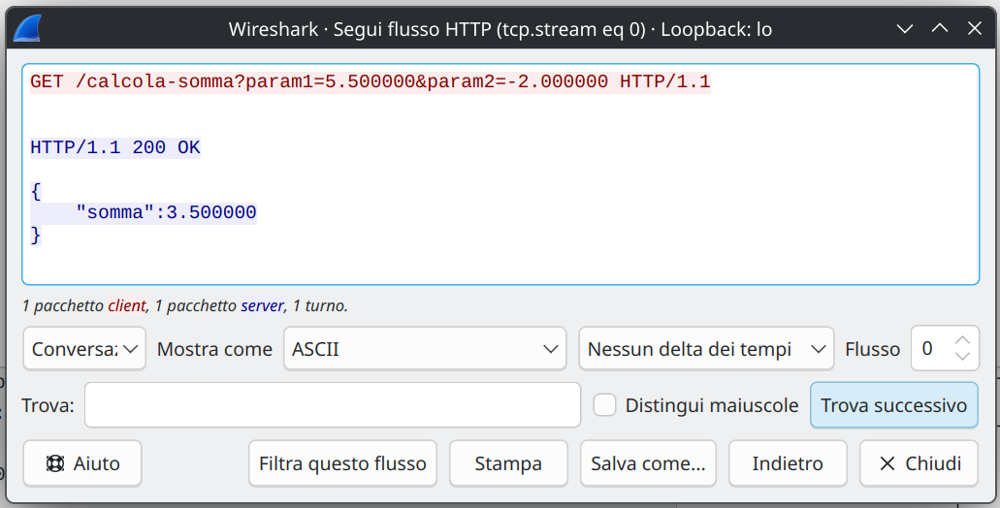

---
tags:
  - Soluzioni
---
### [[2026/WebSocket/web-webservices.pdf#page=18&selection=2,0,2,9&color=note|Esercizio]]
Per usare [[2026/Websocket/Webservice/serverHTTP-REST.c|serverHTTP-REST.c]] l'url da usare è strutturato in questo modo:

<code>http://localhost:8000/calcola-somma?param1=num1&amp;param2=num2</code>

dove num1 e num2 sono numeri, e possono essere positivi, negativi e decimali.
Per usare [[2026/Websocket/Webservice/clientREST-GET.c|clientREST-GET.c]] i parametri sono:

<code>./clientREST-GET tipofunzione op1 op2</code>

<code style="background: transparent; color: #d19a66;">tipofunzione</code> = al momento l'unica opzione è <code style="background: transparent; color: #98c379;">"calcola-somma"</code> <code style="background: transparent; color: #d19a66;">op1</code> = è il valore che assumerà il primo numero (<code style="background: transparent; color: #98c379;">num1</code>) <code style="background: transparent; color: #d19a66;">op2</code> = è il valore che assumerà il secondo numero (<code style="background: transparent; color: #98c379;">num2</code>) 
Analisi con wireshark:

La *signature* della funzione calcolaSomma() sia nel client che nel server:
- **nome** -> calcolaSomma
- **tipo di ritorno** -> float
- **numero e tipo di parametri** -> 2, float, float 

Motivo principale è per la **Coerenza dei Dati** ovvero se il server restituisce un `int`, il client deve aspettarsi un `int`. Se le firme fossero diverse (es. il client manda un intero ma il server aspetta un float), il sistema fallirebbe o produrrebbe risultati errati.
Motivo aggiuntivo è che il programmatore non deve imparare un nuovo modo di chiamare la funzione. I parametri sono due ambi i casi e sono i `float` che rappresentano i numeri da sommare.
### [[2026/WebSocket/web-webservices.pdf#page=19&selection=2,0,2,11&color=note|Esercizio 2]]
Avere il server in C e il client in Java è un'opportunità di **Interoperabilità**. Dimostra che il protocollo HTTP funge da linguaggio universale, permettendo a tecnologie diverse di cooperare. Questo elimina i vincoli tecnologici e permette di scegliere il linguaggio di programmazione migliore per ogni specifico compito (C per le prestazioni, Java per la versatilità).
### [[2026/WebSocket/web-webservices.pdf#page=20&selection=2,0,2,11&color=note|Esercizio 3]]
