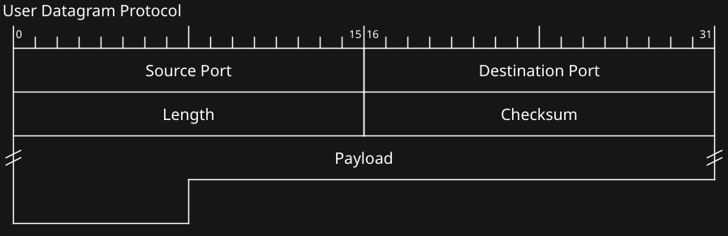

---
tags:
  - Wireshark-analisi-rete
  - Soluzioni
---
[[2026/wireshark-analisi-rete/analisi-rete.pdf#page=13&selection=6,0,6,11&color=note|Esercizio 1]]
1. Il livello data-link usato è Ethernet II.
Wireshark capisce che è Ethernet II perché la scheda di rete, quando cattura un segnale dal cavo, manda sempre anche un **modulo informativo** (creato dai driver Npcap).
Questa informazione dice a Wireshark "Encapsulation type: Ethernet (1)", il codice 1 secondo lo standard identifica che è stata utilizzata la strada Ethernet.	

2. Disegno della PDU livello data-link:

Destination/source = chi riceve e chi manda il messaggio
Type = nel pacchetto 9 contiene il codice <code>0x0800</code> che è l'identificativo del protocollo ipv4
 [[Extra/Extra#ARP|ARP]]

3. Il MAC sorgente si trova nel Source dell'header ed è: 00:e0:81:24:dd:64 .
Il MAC sorgente è di tipo unicast, è impossibile che un pacchetto sia inviato in broadcast.

4. Il MAC destinatario si trova nel Destination dell'header ed è: ff:ff:ff:ff:ff:ff .
Il MAC destinatario è di tipo unicast.

5. Il protocollo di livello Network utilizzato è il IPv4 che viene specificato nella sezione Type dell'header

6. La dimensione dell'headere IP è di 160bit o 20byte

7. Gli indirizzi ip di sorgente e destinazione sono:
Sorgente: 157.27.252.223
Destinatario: 127.27.252.255 (broadcast)

8. Il livello trasporto usato è l'UDP.
Wireshark lo sa perché viene specificato nella sezione Protocol dell'header IP.

9. Le porte di sorgente e destinazione a livello trasporto sono:
Sorgente: 631
Destinazione: 631

Si trovano nell'header di livello trasporto nella sezione Source Port e Destination Port

10. Filtrare solo i pacchetti ARP: <code>arp</code>

11. Dopo aver applicato il filtro i pacchetti visualizzati sono 173 / 272 ovvero il 63.6%

12. 