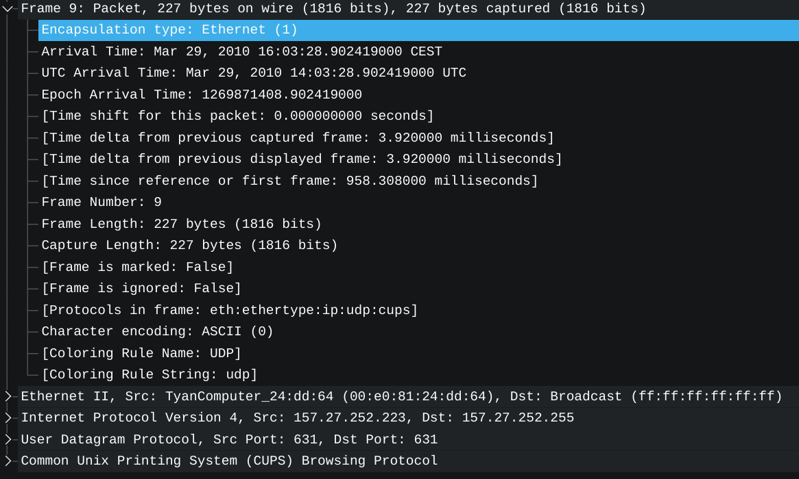
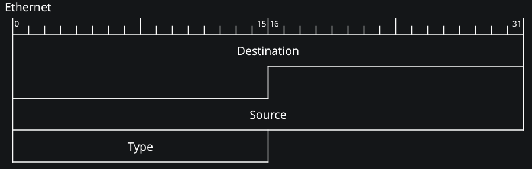
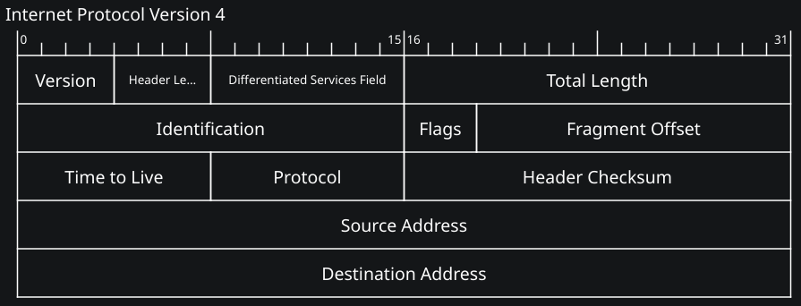

---
tags:
  - Wireshark-analisi-rete
  - Soluzioni
---
### [[2026/wireshark-analisi-rete/analisi-rete.pdf#page=13&selection=6,0,6,11&color=note|Esercizio 1]]

1. Il livello data-link usato è Ethernet II.
Wireshark capisce che è Ethernet II perché la scheda di rete, quando cattura un segnale dal cavo, manda sempre anche un **modulo informativo** (creato dai driver Npcap).
Questa informazione dice a Wireshark "Encapsulation type: Ethernet (1)", il codice 1 secondo lo standard identifica che è stata utilizzata la strada Ethernet.	

<p style="text-align:center;"></p>

2. Disegno della PDU livello data-link:
<p style="text-align:center;"></p>

Destination/source = chi riceve e chi manda il messaggio
Type = nel pacchetto 9 contiene il codice <code>0x0800</code> che è l'identificativo del protocollo ipv4

3. Il MAC sorgente si trova nel Source dell'header ed è: 00:e0:81:24:dd:64 .
Il MAC sorgente è di tipo unicast, è impossibile che un pacchetto sia inviato in broadcast.

4. Il MAC destinatario si trova nel Destination dell'header ed è: ff:ff:ff:ff:ff:ff .
Il MAC destinatario è di tipo unicast.

5. Il protocollo di livello Network utilizzato è il IPv4 che viene specificato nella sezione Type dell'header

6. La dimensione dell'header IP è di 160bit o 20byte
<p style="text-align:center;"></p>
7. Gli indirizzi IP di sorgente e destinazione sono:
Sorgente: <code>157.27.252.223</code>
Destinatario: <code>127.27.252.255 (broadcast)</code>

8. Il livello trasporto usato è l'UDP.
Wireshark lo sa perché viene specificato nella sezione Protocol dell'header IP.

9. Le porte di sorgente e destinazione a livello trasporto sono:
Sorgente: 631
Destinazione: 631
<p style="text-align:center;"></p>

Si trovano nell'header di livello trasporto nella sezione Source Port e Destination Port

10. Filtrare solo i pacchetti [[Extra/Extra#ARP|ARP]]: <code>arp</code> .
11. Dopo aver applicato il filtro i pacchetti visualizzati sono 173 / 272, ovvero il 63.6%

12. Filtrare i pacchetti che hanno come MAC destinatario: <code>00:01:e6:57:4b:e0</code> .
Il filtro utilizzato è <code>eth.dst == 00:01:e6:57:4b:e0</code> .
13. Con il filtro applicato rimane solo un pacchetto 1 / 272, ovvero il 0.4%

14. Filtrare i pacchetti che hanno come MAC destinatario l'indirizzo broadcast.
Il filtro utilizzato è <code>eth.dst == ff:ff:ff:ff:ff:ff</code> .
15. Dopo aver applicato il filtro i pacchetti visualizzati sono 228 / 272, ovvero il 83.8%.
Sono tanti perché durante l'analisi della rete stava avvenendo una mappatura degli host. Motivo concentro potenziale è che lo switch non aveva ancora memorizzato gli host e quindi invia tutti i messaggi verso tutti finché non conosce tutti gli host connessi a lui.

### [[2026/wireshark-analisi-rete/analisi-rete.pdf#page=14&selection=43,0,43,11&color=note|Esercizio 2]]

1. Per colorare i pacchetti [[Extra#TCP|TCP]] e [[Extra#UDP|UDP]] di verde e rosso bisogna andare nel menù <code>Visualizza</code> di Wireshark, poi nel sotto-menù <code>Regole di colorazione</code>. Nella nuova pagina selezionare i pacchetti <code>tcp</code> e impostare il colore verde come sfondo, per i pacchetti <code>udp</code> impostare il colore rosso.
<p style="text-align:center;"><code>Wireshark > Visualizza > Regole di colorazione</code></p>

2. Frame 1:
<table>
<tr><th>Ip sorgente</th><th>157.27.252.202</th></tr>
<tr><th>Ip destinatario</th><th>157.27.10.10</th></tr>
<tr><th>Tipo di protollo trasporto</th><th>UDP</th></tr>
<tr><th>Tipo di protollo applicazione</th><th>DNS</th></tr>
<tr><th>Payload applicazione</th><th>www.polito.it<br>Type A<br>Class IN</th></tr>
</table><br>
Frame 2:
<table>
<tr><th>Ip sorgente</th><th>157.27.10.10</th></tr>
<tr><th>Ip destinatario</th><th>157.27.252.202</th></tr>
<tr><th>Tipo di protollo trasporto</th><th>UDP</th></tr>
<tr><th>Tipo di protollo applicazione</th><th>DNS</th></tr>
<tr><th>Payload applicazione</th><th>web01.polito.it<br>type A<br>class IN<br>addr 130.192.73.1</th></tr>
</table>

Il payload del primo frame contiene la domanda del [[Extra#DNS|DNS]] (query) mentre il secondo frame contiene la risposta. Wireshark capisce che i pacchetti sono DNS perché la porta usata è la 53 (ovvero una [[Extra#Well-known ports|Well-known port]])

3. Frame 3:
<table>
<tr><th>Ip sorgente</th><th>157.27.252.202</th></tr>
<tr><th>Ip destinatario</th><th>130.192.73.1</th></tr>
</table>
Da questo pacchetto capiamo che la richiesta al DNS è andata a buon fine e ora l'host si sta interfacciando con il sito cercato precedentemente.<br>
4. Frame 6
<table>
<tr><th>Ip sorgente</th><th>157.27.252.202</th></tr>
<tr><th>Ip destinatario</th><th>130.192.73.1</th></tr>
<tr><th>Tipo di protollo trasporto</th><th>TCP</th></tr>
<tr><th>Tipo di protollo applicazione</th><th>HTTP</th></tr>
</table>
I tre pacchetti prima di questo fanno parte del [[Extra#Three way handshake|Three way handshake]] che serve instaurare una connessione [[Extra#TCP|TCP]] verso il server.
Le flag dei 3 pacchetti sono:
- <code><b>0x002 (SYN)</b></code> richiesta di connessione da parte del client
- <code><b>0x012 (SYN, ACK)</b></code> conferma di connessione dal server
- <code><b>0x010 (ACK)</b></code> conferma di connessione dal client

5. Filtro per vedere solo i pacchetti TCP (compresi HTTP): <code>tcp</code>
Dopo aver applicato il filtro vengono visualizzati 807 / 823 pacchetti, ovvero il 98.1%

6. Filtro per vedere solo i pacchetti TCP (HTTP esclusi): <code>tcp && !http</code>
Dopo aver applicato il filtro vengono visualizzati 673 / 823 pacchetti, ovvero l' 81.8%
Questi pacchetti comprendono tutti i messaggi di Three way handshake, di conferma di ricezione (ACK) e del controllo del flusso e della congestione.
Se il protocollo DNS avesse usato una connessione TCP si sarebbero aggiunti 3 pacchetti per aprire la connessione, i pacchetti di conferma per domanda e risposta e 3-4 per la chiusura della **sessione**. In questo caso usare una connessione TCP non sarebbe stato utile perché i messaggi di domanda e risposta del DNS sono molto piccoli e usare il protocollo TCP avrebbe creato latenza elevata per un carico di traffico inutile.

7. Usando il seguente comando sul terzo pacchetto
<p style="text-align:center;"><code>Tasto destro > Segui > Flusso TCP</code></p>
possiamo leggere l'intera conversazione tra il client e il server.
Nel payload troviamo in rosso le richieste GET del client e in blu le relative risposte dal server che condivide i dati della pagina web richiesta. 

### [[2026/wireshark-analisi-rete/analisi-rete.pdf#page=15&selection=0,0,0,11&color=note|Esercizio 3]]
1. Protocolli di livello applicazione ordinati per protocolli di livello trasporto:
I pacchetti che navigano in sessione UDP sono tutti DNS.
TCP:
* FTP
* HTTP
* SSH
Per trovarli ho usato i filtri <code>udp</code> e <code>tcp</code>. Per quelli TCP ho ordinato per Protocol invece che Numero per avere una visualizzazione più facile.

2. Comando usato:
<p style="text-align:center;"><code>Tasto destro su pacchetto > Segui > Flusso TCP</code></p>
Esempi su protocolli applicazione diversi:
FTP contiene comandi per il trasferimento. HTTP contiene le funzioni GET delle pagine e le risposte in chiaro. SSH contiene informazioni cifrate. Poi ci sono anche i pacchetti che non hanno un protocollo di livello applicazione ma sono TCP e sono usati per handshake, ACK e chiusura connessione.

3. Nel protocollo FTP i dati non sono criptati perché è un protocollo in chiaro. Seguendo il flusso si può leggere tutto il contenuto.
Il protocollo SSH, a differenza del FTP, è un protocollo cifrato. Seguendo il flusso i dati non sono leggibili perché cifrati.

### [[2026/wireshark-analisi-rete/analisi-rete.pdf#page=15&selection=27,0,27,11&color=note|Esercizio 4]]
1. Per filtrare solo i pacchetti ping si usa il filtro: <code>icmp</code> ([[Extra#ICMP|ICMP]])
I pacchetti presenti sono 22 / 3215, ovvero il 0.7%
Filtri con caratteristiche extra:
- <code>icmp.type == 8</code> per i ping richieste
- <code>icmp.type == 0</code> per i ping risposte (pong)
Per ciascuna variante ci sono 11 / 3215 pacchetti

2. L'indirizzo IP sorgente è: <code>216.58.211.196</code>
L'indirizzo IP destinazione è: <code>157.27.143.46</code>
Con il comando <code>whois 157.27.143.46</code>, il dato che ci interessa è <code>org-name:       Universita' degli Studi di Verona</code>.
Con il comando <code>whois 216.58.211.196</code>, il risultato è <code>OrgName:        Google LLC</code>

3. Il comando per trovare l'indirizzo IP del gateway è:
<p style="text-align:center"><code>❯ ip -4 route</code></p>
Oppure con l'alias (o su windows):
<p style="text-align:center"><code>❯ ipconfig</code></p>
L'output è:
```default via <b>157.27.128.1</b> dev wlan0 proto dhcp src 157.27.157.98 metric 600<br>```
```157.27.128.0/19 dev wlan0 proto kernel scope link src 157.27.157.98 metric 600```
L'IP del gateway è <code><b>157.27.128.1</b></code>:

Comando per fare il ping al sito www.google.com:
<p style="text-align:center"><code>❯ ping www.google.com</code></p>
Per forzare l'utilizzo di IPv4:
<p style="text-align:center"><code>❯ ping -4 www.google.com</code></p>

```
❯ ping -c 5 www.google.com<br>
PING www.google.com (142.251.153.119) 56(84) bytes of data.
64 bytes from 142.251.153.119: icmp_seq=1 ttl=116 time=14.6 ms
64 bytes from 142.251.153.119: icmp_seq=2 ttl=116 time=16.2 ms
64 bytes from 142.251.153.119: icmp_seq=3 ttl=116 time=14.4 ms
64 bytes from 142.251.153.119: icmp_seq=4 ttl=116 time=18.5 ms
64 bytes from 142.251.153.119: icmp_seq=5 ttl=116 time=15.7 ms 
```
La media del RTT (Round Trip Time) è <code><b>15.88 ms</b></code>.

```
❯ ping -c 5 157.27.128.1
PING 157.27.128.1 (157.27.128.1) 56(84) bytes of data.
64 bytes from 157.27.128.1: icmp_seq=1 ttl=254 time=10.7 ms
64 bytes from 157.27.128.1: icmp_seq=2 ttl=254 time=11.0 ms
64 bytes from 157.27.128.1: icmp_seq=3 ttl=254 time=3.72 ms
64 bytes from 157.27.128.1: icmp_seq=4 ttl=254 time=12.8 ms
64 bytes from 157.27.128.1: icmp_seq=5 ttl=254 time=3.49 ms
```
La media del RTT (Round Trip Time) è <code><b>8.34 ms</b></code>.

La media verso il gateway è più bassa perché guardando la topologia di rete il gateway è più vicino al computer sorgente del ping.

### [[2026/wireshark-analisi-rete/analisi-rete.pdf#page=15&selection=66,0,66,11&color=note|Esercizio 5]]
1. Il comando <code>❯ traceroute ww.google.com</code> mostra ogni singolo salto (router) che il pacchetto attraversa dal computer sorgente al destinatario.
```
❯ traceroute -4 www.google.com
traceroute to www.google.com (142.250.181.164), 30 hops max, 60 byte packets
 1  _gateway (157.27.128.1)  4.195 ms  4.114 ms  4.097 ms
 2  10.252.10.1 (10.252.10.1)  4.080 ms  4.065 ms  4.050 ms
 3  ru-univr-l1-rl1-vr00.vr00.garr.net (193.204.218.109)  4.029 ms  5.002 ms  4.987 ms
 4  * * *
 5  rs1-mi01-re1-mi02.mi02.garr.net (185.191.180.158)  7.853 ms  7.839 ms  6.674 ms
 6  142.250.164.230 (142.250.164.230)  7.121 ms  19.671 ms  19.575 ms
 7  192.178.104.103 (192.178.104.103)  19.560 ms 192.178.104.191 (192.178.104.191)  19.542 ms 192.178.104.103 (192.178.104.103)  19.532 ms
 8  108.170.232.180 (108.170.232.180)  19.514 ms 192.178.82.62 (192.178.82.62)  19.499 ms 142.251.235.179 (142.251.235.179)  12.312 ms
 9  108.170.255.204 (108.170.255.204)  11.120 ms pnmila-ak-in-f4.1e100.net (142.250.181.164)  12.242 ms 108.170.255.204 (108.170.255.204)  11.084 ms
```
2. Nomi organizzazioni dei router attraversati e trovati:
- <code>157.27.128.1</code> -> <code>org-name:       Universita' degli Studi di Verona</code>
- 10.252.10.1 -> indirizzo privato nella rete universitaria
- 193.204.218.109 -> <code>org-name: Consortium GARR</code>
- 185.191.180.158 -> <code>org-name: Consortium GARR</code>
- 142.250.164.230 -> <code>org-name: Google LLC</code>
- 192.178.104.103 -> <code>org-name: Google LLC</code>
- 108.170.232.180 -> <code>org-name: Google LLC</code>
- 142.250.181.164 -> <code>org-name: Google LLC</code>

### [[2026/wireshark-analisi-rete/analisi-rete.pdf#page=15&selection=85,0,85,11&color=note|Esercizio 6]]
1. Con il comando <code>ipconfig</code> (su arch <code>ip -4 a</code>) vedo quali sono le interfacce attive sul computer. Risultato:
```
1: lo: <LOOPBACK,UP,LOWER_UP> mtu 65536 qdisc noqueue state UNKNOWN group default qlen 1000
    inet 127.0.0.1/8 scope host lo
       valid_lft forever preferred_lft forever
2: wlan0: <BROADCAST,MULTICAST,UP,LOWER_UP> mtu 1500 qdisc noqueue state UP group default qlen 1000
    inet 157.27.142.13/19 brd 157.27.159.255 scope global dynamic noprefixroute wlan0
       valid_lft 2018sec preferred_lft 2018sec
```
La prima è l'interfaccia di [[Extra#Loopback|loopback]] (<code>lo</code>):
- IP 127.0.0.1
- netmask (/8) 255.0.0.0
La seconda è l'interfaccia <code>wlan0</code> (connessa al wifi):
- IP 157.27.142.13
- netmask (/19) 255.255.224.0 .

2. L'indiritto IP di www.univr.it è 157.27.3.60.
Trovato usando il comando: <code>❯ nslookup www.univr.it</code> . Risultato:
``` 
Server:		127.0.0.53
Address:	127.0.0.53#53

Non-authoritative answer:
www.univr.it	canonical name = aol.univr.it.
Name:	aol.univr.it
Address: 157.27.3.60
Name:	aol.univr.it
Address: 2001:760:2204:103::60 
```
